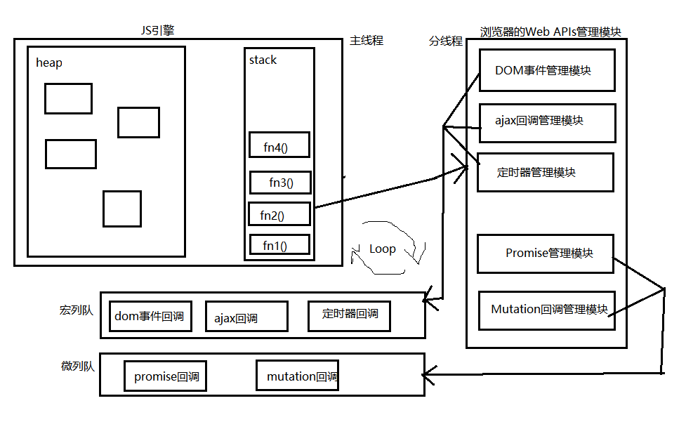

# Promise从入门到深入
## 1. 准备
### 1.1. 函数对象与实例对象
    1. 函数对象: 将函数作为对象使用时, 简称为函数对象
    2. 实例对象: new 函数产生的对象, 简称为对象
    点的左边是对象，括号左边是函数

### 1.2. 回调函数的分类
    1. 同步回调: 
        理解: 立即执行, 完全执行完了才结束, 不会放入回调队列中
        例子: 数组遍历相关的回调函数 / Promise的excutor函数
    2. 异步回调: 
        理解: 不会立即执行, 会放入回调队列中将来执行
        例子: 定时器回调 / ajax回调 / Promise的成功|失败的回调

### 1.3. JS中的Error
    1. 错误的类型
        Error: 所有错误的父类型
        ReferenceError: 引用的变量不存在
        TypeError: 数据类型不正确的错误
        RangeError: 数据值不在其所允许的范围内
        SyntaxError: 语法错误
    2. 错误处理
        捕获错误: try ... catch
        抛出错误: throw error
    3. 错误对象
        message属性: 错误相关信息
        stack属性: 函数调用栈记录信息

- <span style="color:orange">即使在try或者catch中return，finally中的语句还是会执行的。</span>
- <span style="color:orange">在try中，如果在抛出错误之前return的话，catch就不会执行了，因为还没到抛出错误就return了呀。</span>

## 2. Promise的理解和使用
### 2.1. Promise是什么?
    1.抽象表达: 
        Promise是一门新的技术(ES6规范)
        Promise是JS中进行异步编程的新解决方案(旧的是谁?)。
        Promise之前我们使用的是纯回调函数进行异步编程。
    2.具体表达:
        从语法上来说: Promise是一个构造函数
        从功能上来说: promise对象用来封装一个异步操作并可以获取其成功/失败的结果值
    3. promise的状态改变(只有2种, 只能改变一次)
        pending变为resolved
        pending变为rejected
    4. promise的基本流程


### 2.2. 为什么要用Promise?
    1. 指定回调函数的方式更加灵活: 可以在请求发出甚至结束后指定回调函数
    2. 支持链式调用, 可以解决回调地狱问题

### 2.3. 如何使用Promise?
#### 主要API

```js
Promise构造函数: Promise (excutor) {}
Promise.prototype.then方法: (onResolved, onRejected) => {}
Promise.prototype.catch方法: (onRejected) => {}
Promise.resolve方法: (value) => {}
Promise.reject方法: (reason) => {}
Promise.all方法: (promises) => {}
Promise.race方法: (promises) => {}
```

#### 几个重要问题

- 如何改变promise的状态?

    - 调用resolve或者reject函数。
    - executor中抛出异常，状态改变为rejected。<span style="color:red">错误要在executor中抛出。也就是在promise源码中，对executor函数进行了异常捕获。而且捕获到异常之后，executor内后续代码不会执行。</span><span style="color:red;font-weight:bold">最重要的是，捕获到异常后，要判断promise状态是否为pending，如果已经是resolved或者rejected，其实就不会进行任何操作。如果是pending，则状态变为rejected.</span>其实，捕获到异常后调用的函数是executor中的`reject(error)`

- 一个promise指定多个成功/失败回调函数, 都会调用吗?

    - 当promise改变为对应状态时都会调用

    - ```js
        p.then(
            value => console.log('onResolved()', value),
            reason => console.log('onRejected()', reason)
        );
        p.then(
            value => console.log('onResolved2()', value),
            reason => console.log('onRejected2()', reason)
        )
        ```

- promise.then()返回的新promise的结果状态由什么决定?

    - 简单表达: 由then()指定的回调函数执行的结果决定

    - 详细表达:

        1. 如果抛出异常, 新promise变为rejected, reason为抛出的异常
        2. 如果返回的是非promise的任意值（包括没有返回值，也就是undefined;以及从reason中返回非promise的任意值）, 新promise变为resolved, value为返回的值
        3. 如果返回的是另一个新promise, 此promise的结果就会成为新promise的结果 

        ```js
        return Promise.resolve(5)
        return Promise.reject(5)
        return new Promise((resolve, reject)=>{})
        ```

- 改变promise状态和指定回调函数谁先谁后?

    - 都有可能, 正常情况下是先指定回调再改变状态, 但也可以先改状态再指定回调
    - 如何先改状态再指定回调?
        - 在执行器中直接调用resolve()/reject()
        - 延迟更长时间才调用then()
    - 什么时候才能得到数据?
        - ①如果先指定的回调, 那当状态发生改变时, 回调函数就会进入消息队列, 得到数据
        - ②如果先改变的状态, 那当指定回调时, 回调函数就会进入消息队列, 得到数据

- promise如何串连多个操作任务?

    - promise的then()返回一个新的promise,可以连成then()的链式调用

    - 通过then的链式调用串连多个同步/异步任务，<span style="color:red">对于链式调用中的异步任务，必须是包裹在一个promise对象中并返回，否则的话，这个promise的结果就会丢了、</span> 

    - ```js
        new Promise((resolve, reject) => {
              // 启动任务1(异步)
              console.log('启动任务1(异步)')
              setTimeout(() => {
                resolve(1)
              }, 1000)
            }).then(value => {
              console.log('任务1成功的value为', value)
              // 执行任务2(同步)
              console.log('执行任务2(同步)')
              return 2
            }).then(value => {
              console.log('任务2成功的vlaue为', value)
              // 执行任务3(异步)
              return new Promise((resolve, reject) => {
                console.log('调动任务3(异步)')
                setTimeout(() => {
                  resolve(3)
                }, 1000);
              })
            }).then(value => {
              console.log('任务3成功的value为: ', value)
            })
        ```

- <span style="color:red;font-weight:bold;font-size:18px">promise错误穿透</span>未指定onResolved时，这个也是会传递的。

    - 当使用promise的then链式调用时, 可以在最后指定失败的回调,前面任何操作出了错误, 都会传到最后失败的回调中处理。

    - 也就是当没有指定失败的回调函数时，会默认添加了抛出reason的失败回调函数

    - ```js
        new Promise((resolve, reject) => {
        	// resolve(1)
        	reject(2)
        }).then(
            value => console.log('onResolved1()', value),
            // reason => {throw reason}
        ).then(
            value => console.log('onResolved2()', value),
            // reason => Promise.reject(reason)
        ).then(
            value => console.log('onResolved3()', value),
            // reason => {throw reason}
        ).catch(reason => {
        	console.log('onRejected1()', reason)
        })
        ```

- 中断promise链

    - <span style="color:red">return一个pending的promise对象。</span>

    - 如下代码的输出，先输出`onRejected3() 5`，再输出`onRejected1() 2`，是因为new队形和Promise对象内的执行函数`excutor`是同步执行的，后续的内容是异步执行的，那么就是先把两个构造函数及执行函数给执行了，然后一个接一个的回调。但是因为第一个链式回调的输出结果`onRejected1() 2`位于链中的第4位，所以就输出的晚一点了。

    - ```js
        new Promise((resolve, reject) => {
          // resolve(1)
          reject(2)
        }).then(
          value => console.log('onResolved1()', value),
          // reason => {throw reason}
        ).then(
          value => console.log('onResolved2()', value),
          // reason => Promise.reject(reason)
        ).then(
          value => console.log('onResolved3()', value),
          // reason => {throw reason}
        ).catch(reason => {
          console.log('onRejected1()', reason)
          // throw reason
          return new Promise(() => {}) // 返回一个pending状态的promise ==> 中断promise链接  
        }).then(
          value => console.log('onResolved4()', value),
          reason => console.log('onRejected2()', reason)
        )
        
        new Promise((resolve, reject) => {
          // resolve(1)
          reject(5)
        }).then(
          value => {
            console.log('onResolved1()', value)
          },
          // reason => {throw reason}
        ).then(
          value => {
            console.log('onResolved2()', value)
          },
          // ()=> new Promise(() => {})
        ).then(
          value => {
            console.log('onResolved3()', value)
          },
          reason => {
            console.log("onRejected3()", reason);
          }
        )
        ```


<div style="width:100%;border-bottom:1px solid red;">从这里往后的都是mdn上的内容</div>

## [3.Promise 拒绝事件](https://developer.mozilla.org/zh-CN/docs/Web/JavaScript/Guide/Using_promises#promise_拒绝事件)

当 Promise 被拒绝时，会有下文所述的两个事件之一被派发到全局作用域（通常而言，就是[`window`](https://developer.mozilla.org/zh-CN/docs/Web/API/Window)；如果是在 web worker 中使用的话，就是 [`Worker`](https://developer.mozilla.org/zh-CN/docs/Web/API/Worker) 或者其他 worker-based 接口）。这两个事件如下所示：

- [`rejectionhandled`](https://developer.mozilla.org/zh-CN/docs/Web/API/Window/rejectionhandled_event)

    当 Promise 被拒绝、并且在 `reject` 函数处理该 rejection 之后会派发此事件。

- [`unhandledrejection`](https://developer.mozilla.org/zh-CN/docs/Web/API/Window/unhandledrejection_event)

    当 Promise 被拒绝，但没有提供 `reject` 函数来处理该 rejection 时，会派发此事件。

以上两种情况中，[`PromiseRejectionEvent`](https://developer.mozilla.org/zh-CN/docs/Web/API/PromiseRejectionEvent) 事件都有两个属性，一个是 [`promise`](https://developer.mozilla.org/zh-CN/docs/Web/API/PromiseRejectionEvent/promise) 属性，该属性指向被驳回的 Promise，另一个是 [`reason` (en-US)](https://developer.mozilla.org/en-US/docs/Web/API/PromiseRejectionEvent/reason) 属性，该属性用来说明 Promise 被驳回的原因。

因此，我们可以通过以上事件为 Promise 失败时提供补偿处理，也有利于调试 Promise 相关的问题。在每一个上下文中，该处理都是全局的，因此不管源码如何，所有的错误都会在同一个处理函数中被捕捉并处理。

一个特别有用的例子：当你使用 [Node.js](https://developer.mozilla.org/en-US/docs/Glossary/Node.js) 时，有些依赖模块可能会有未被处理的 rejected promises，这些都会在运行时打印到控制台。你可以在自己的代码中捕捉这些信息，然后添加与 [`unhandledrejection`](https://developer.mozilla.org/zh-CN/docs/Web/API/Window/unhandledrejection_event) 相应的处理函数来做分析和处理，或只是为了让你的输出更整洁。举例如下：

```
window.addEventListener("unhandledrejection", event => {
  /* 你可以在这里添加一些代码，以便检查
     event.promise 中的 promise 和
     event.reason 中的 rejection 原因 */

  event.preventDefault();
}, false);
```

调用 event 的 [`preventDefault()`](https://developer.mozilla.org/zh-CN/docs/Web/API/Event/preventDefault) 方法是为了告诉 JavaScript 引擎当 Promise 被拒绝时不要执行默认操作，默认操作一般会包含把错误打印到控制台，Node 就是如此的。

理想情况下，在忽略这些事件之前，我们应该检查所有被拒绝的 Promise，来确认这不是代码中的 bug。

## [4.在旧式回调 API 中创建 Promise](https://developer.mozilla.org/zh-CN/docs/Web/JavaScript/Guide/Using_promises#在旧式回调_api_中创建_promise)

可以通过 Promise 的构造器从零开始创建 [`Promise`](https://developer.mozilla.org/zh-CN/docs/Web/JavaScript/Reference/Global_Objects/Promise)。 这种方式（通过构造器的方式）应当只在封装旧 API 的时候用到。

理想状态下，所有的异步函数都已经返回 Promise 了。但有一些 API 仍然使用旧方式来传入的成功（或者失败）的回调。典型的例子就是 [`setTimeout()` (en-US)](https://developer.mozilla.org/en-US/docs/Web/API/WindowOrWorkerGlobalScope/setTimeout) 函数：

```
setTimeout(() => saySomething("10 seconds passed"), 10000);
```

混用旧式回调和 Promise 可能会造成运行时序问题。如果 `saySomething` 函数失败了，或者包含了编程错误，那就没有办法捕获它了。这得怪 `setTimeout`。

幸运地是，我们可以用 Promise 来封装它。最好的做法是，将这些有问题的函数封装起来，留在底层，并且永远不要再直接调用它们：

```
const wait = ms => new Promise(resolve => setTimeout(resolve, ms));

wait(10000).then(() => saySomething("10 seconds")).catch(failureCallback);
```

通常，Promise 的构造器接收一个执行函数(executor)，我们可以在这个执行函数里手动地 resolve 和 reject 一个 Promise。既然 `setTimeout` 并不会真的执行失败，那么我们可以在这种情况下忽略 reject。

## [5.组合](https://developer.mozilla.org/zh-CN/docs/Web/JavaScript/Guide/Using_promises#组合)

[`Promise.resolve()`](https://developer.mozilla.org/zh-CN/docs/Web/JavaScript/Reference/Global_Objects/Promise/resolve) 和 [`Promise.reject()`](https://developer.mozilla.org/zh-CN/docs/Web/JavaScript/Reference/Global_Objects/Promise/reject) 是手动创建一个已经 resolve 或者 reject 的 Promise 快捷方法。它们有时很有用。

[`Promise.all()`](https://developer.mozilla.org/zh-CN/docs/Web/JavaScript/Reference/Global_Objects/Promise/all) 和 [`Promise.race()`](https://developer.mozilla.org/zh-CN/docs/Web/JavaScript/Reference/Global_Objects/Promise/race) 是并行运行异步操作的两个组合式工具。

我们可以发起并行操作，然后等多个操作全部结束后进行下一步操作，如下：

```
Promise.all([func1(), func2(), func3()])
.then(([result1, result2, result3]) => { /* use result1, result2 and result3 */ });
```

可以使用一些聪明的 JavaScript 写法实现时序组合：

```
[func1, func2, func3].reduce((p, f) => p.then(f), Promise.resolve())
.then(result3 => { /* use result3 */ });
```

通常，我们递归调用一个由异步函数组成的数组时，相当于一个 Promise 链：

```
Promise.resolve().then(func1).then(func2).then(func3);
```

我们也可以写成可复用的函数形式，这在函数式编程中极为普遍：

```
const applyAsync = (acc,val) => acc.then(val);
const composeAsync = (...funcs) => x => funcs.reduce(applyAsync, Promise.resolve(x));
```

`composeAsync()` 函数将会接受任意数量的函数作为其参数，并返回一个新的函数，该函数接受一个通过 composition pipeline 传入的初始值。这对我们来说非常有益，因为任一函数可以是异步或同步的，它们能被保证按顺序执行：

```
const transformData = composeAsync(func1, func2, func3);
const result3 = transformData(data);
```

在 ECMAScript 2017 标准中, 时序组合可以通过使用 `async/await` 而变得更简单：

```
let result;
for (const f of [func1, func2, func3]) {
  result = await f(result);
}
/* use last result (i.e. result3) */
```

## [6.时序](https://developer.mozilla.org/zh-CN/docs/Web/JavaScript/Guide/Using_promises#时序)

为了避免意外，即使是一个已经变成 resolve 状态的 Promise，传递给 `then()` 的函数也总是会被异步调用：

```
Promise.resolve().then(() => console.log(2));
console.log(1); // 1, 2
```

传递到 `then()` 中的函数被置入到一个微任务队列中，而不是立即执行，这意味着它是在 JavaScript 事件队列的所有运行时结束了，且事件队列被清空之后，才开始执行：

```
const wait = ms => new Promise(resolve => setTimeout(resolve, ms));

wait().then(() => console.log(4));
Promise.resolve().then(() => console.log(2)).then(() => console.log(3));
console.log(1); // 1, 2, 3, 4
```

## [7.嵌套](https://developer.mozilla.org/zh-CN/docs/Web/JavaScript/Guide/Using_promises#嵌套)

简便的 Promise 链式编程最好保持扁平化，不要嵌套 Promise，因为嵌套经常会是粗心导致的。可查阅下一节的[常见错误](https://developer.mozilla.org/zh-CN/docs/Web/JavaScript/Guide/Using_promises#常见错误)中的例子。

嵌套 Promise 是一种可以限制 `catch` 语句的作用域的控制结构写法。明确来说，嵌套的 `catch` 仅捕捉在其之前同时还必须是其作用域的 failureres，而捕捉不到在其链式以外或者其嵌套域以外的 error。如果使用正确，那么可以实现高精度的错误修复。

```js
doSomethingCritical()
.then(result => doSomethingOptional()
  .then(optionalResult => doSomethingExtraNice(optionalResult))
  .catch(e => {console.log(e.message)})) // 即使有异常也会忽略，继续运行;(最后会输出)
.then(() => moreCriticalStuff())
.catch(e => console.log("Critical failure: " + e.message));// 没有输出
```

注意,有些代码步骤是嵌套的，而不是一个简单的纯链式，这些语句前与后都被括号 `()` 包裹着。

这个内部的 `catch` 语句仅能捕获到 `doSomethingOptional()` 和 `doSomethingExtraNice()` 的失败，`之后就恢复到moreCriticalStuff()` 的运行。重要提醒：如果 `doSomethingCritical()` 失败，这个错误仅会被最后的（外部）`catch` 语句捕获到。

## 8. 自定义Promise

    1. 定义整体结构
    2. Promise构造函数的实现
    3. promise.then()/catch()的实现
    4. Promise.resolve()/reject()的实现
    5. Promise.all/race()的实现
    6. Promise.resolveDelay()/rejectDelay()的实现
    7. ES6 class版本

## 9. async与await

- async 函数
    函数的返回值为promise对象，promise对象的结果由async函数执行的返回值决定。
    - 如果抛出异常：返回一个rejected的promise对象
    - 如果返回一个promise对象：返回一个状态和这个promise对象相同的promise对象（其实就是返回这个promise对象吧？）
    - 其他情况，返回一个resolved的promise对象
- await 表达式
    - await右侧的表达式一般为promise对象, 但也可以是其它的值
    - 如果表达式是promise对象, await返回的是promise成功的值
    - 如果表达式是其它值, 直接将此值作为await的返回值

- 注意:

    - <span style="color:red;font-weight:bold">await必须写在async函数中, 但async函数中可以没有await</span>

    - <span style="color:red;font-weight:bold">如果await的promise失败了（包括promise的executor抛出错误）, 就会抛出异常, 需要通过try...catch来捕获处理。</span> <span style="color:skyblue;font-weight:bold;font-size:18px">如果await的是一个会抛出错误的函数，那么async就是普通函数的执行顺序，这里边的内容不会进入消息队列。</span>

        ```js
        function throwErr() {  
          throw "this is my throw message";
        }
        
        async function async3(){
          try {
            // let result = await new Promise((resolve,reject)=>{reject("reject!!rejected!!!")});
            let result = await new Promise((resolve,reject)=>{throw "big error"});
            // let result = await throwErr();
            console.log(result);
            console.log("你前边要报错知道吗");
          } catch (error) {
            console.log(error);
          }
        }
        
        async3();
        
        console.log("go go go");
        
        
        1.当选择：let result = await new Promise((resolve,reject)=>{reject("reject!!rejected!!!")});时：
        //执行结果：go go go在错误信息之前
            go go go
            reject!!rejected!!!
        2.当选择：let result = await new Promise((resolve,reject)=>{throw "big error"});时：
        //执行结果：go go go在错误信息之前
            go go go
            big error
        3.当选择：let result = await throwErr();时：
        //执行结果：go go go在错误信息之后
            this is my throw message
            go go go
        ```

        

    - async函数时立即执行完的，只不过是把这些代码给放到promise里边了。

        ```js
          async function async1() {
            let result = await new Promise((resolve,reject)=>{
              setTimeout(()=>{
                resolve("resolved after 1000");
              },3000);
              // resolve(123);
            })
            console.log(result);
            console.log("last line");
          }
          async1();
        
          // 前边async转化成下边的形式
        
          function promiseFun(){
            new Promise((resolve,reject)=>{
              setTimeout(()=>{
                resolve("promiseFun resolved");
              },2000);
            }).then(
              value=>{
                console.log(value);
                console.log("last line");
              }
            )
          }
          promiseFun();
        ```

        ```js
        async function async2() {
            let result = await 7;
            console.log(result);
            console.log("last line");
          }
          async2();
        // 前边async转化成下边的形式
          function promiseFun2(){
            new Promise((resolve,reject)=>{
              resolve(7);
            }).then(
              value=>{
                console.log(value);
                console.log("last line");
              }
            )
          }
          promiseFun2();
        ```

        

- 为什么用async和await

    - <span style="color:red;font-weight:bold">简化promise对象的使用, 不用再通过then指定回调函数取结果数据</span>

    - <span style="color:red;font-weight:bold">回调地狱的终极解决方案，一个async里边多个await</span>

        ```js
        async function async4() {
            let result = await new Promise((resolve,reject)=>{
                setTimeout(()=>{
                	resolve("resolved after 3000");
            	},3000);
            })
            console.log(result);
            console.log("first await");
            
            let result2 = await 7;
            console.log(result2);
            console.log("second await");
            
            let result3 = await new Promise((resolve,reject)=>{
                setTimeout(()=>{
                	resolve("third resolve after second 2000");
                },2000);
            });
            console.log(result3);
        }
        async4();
        console.log("start");
        ```

        > 先输出“start”
        >
        > 等三秒后输出resolved after 3000和first await
        >
        > 紧接着输出7和second await
        >
        > 之后再等两秒输出third resolve after second 2000

<span style="color:orange;font-weight:bold">每出现一个await，就新来一个promise，且下边的内容就都属于这个promise的then函数内的内容。当在这个await后边再遇到一个await之后，那么就是在前一个await对应的promise的then函数的回调内又新来了一个promise，那么第二个await后边的内容，就是在第二个then函数的回调函数内了。</span>以此<span style="color:red;font-weight:bold">嵌套</span>。貌似到底是链式还是嵌套还是没搞明白，先当做链式吧；

那么这里就要涉及到promise中then的链式调用和嵌套调用的异同了。有点乱。

## 10. JS异步之宏队列与微队列


1. 宏列队: 用来保存待执行的宏任务(回调), 比如: 定时器回调/DOM事件回调/ajax回调
2. 微列队: 用来保存待执行的微任务(回调), 比如: promise的回调/MutationObserver的回调
3. JS执行时会区别这2个队列
	<span style="color:red;font-weight:bold">JS引擎首先必须先执行所有的初始化同步任务代码，每次准备取出第一个宏任务执行前, 都要将所有的微任务一个一个取出来执行</span>

```js
setTimeout(() => {
    console.log('setTimeout callback()', 1)
    Promise.resolve(5).then(value => {
        console.log('onResolved3()', value)
    })
}, 0)
setTimeout(() => {
    console.log('setTimeout callback()', 2)
}, 0)
Promise.resolve(3).then(value => {
    console.log('onResolved()', value)
})
Promise.resolve(4).then(value => {
    console.log('onResolved2()', value)
})
//输出顺序：3  4   1  5  2
```

```js
setTimeout(() => {
    console.log(1)
}, 0)
new Promise((resolve) => {
    console.log(2)
    resolve()
}).then(() => {//按顺序执行到这里时，就把这个then里边的回调放进微队列里边了。代码继续解析到下一个then
    console.log(3)
}).then(() => {//代码按顺序执行到这里时，前边的then的状态还没确定，所以是把这个then的回调放进一个数据里边待取出。还没放进微队列
    console.log(4)
})
console.log(5)

// 2 5 3 4 1
```

> <span style="color:orange">下面这一个的重点是当把thenA从微队列里边取出执行时，thenD被放入微队列，thenE被放入回调数组，那么！！！这时整个thenA就按顺序执行完了，thenB就应该要被放入微队列了.</span><span style="color:red">如果用thenA内的注释掉的return语句替换下边的那条语句，最后输出结果的5 和 6要换一下顺序了。因为只有return语句返回出最终结果，thenA才算是执行完成，才能把thenB放进微队列。而return的最终结果需要thenD和thenE都执行完才知道</span>

```js
/*
1 7 2 3 8 4 6 5 0
宏: []
微: []

*/
setTimeout(() => {
	console.log("0")
}, 0)

new Promise((resolve,reject)=>{
    console.log("1")
    resolve()
})
.then(()=>{        //A
    console.log("2")
    //return new Promise((resolve,reject)=>{
    new Promise((resolve,reject)=>{
		console.log("3")
		resolve()
	})
	.then(()=>{      //D  
		console.log("4")
	})
	.then(()=>{      //E 
		console.log("5")
	})
})
.then(()=>{        //B
	console.log("6")
})

new Promise((resolve,reject)=>{
	console.log("7")
	resolve()
})
.then(()=>{         //C
	console.log("8")
})
```

```js
async function async1() {
    console.log('async1 start')
    await async2()  // async2().then(() => {}) async2返回一个成功值undefined						的promise，下面一句作为then回调就加入微队列
    console.log('async1 end')
}

async function async2() {
	console.log('async2')
}

console.log('script start')

setTimeout(() => {
	console.log('setTimeout')   
}, 0)

async1()

new Promise(function (resolve) {
    console.log('promise1')
    resolve()
}).then(function () {
	console.log('promise2')
})
console.log('script end')

/*
宏: []
微: []
*/

/* 
输出: 
script start
async1 start
async2
promise1
script end
async1 end
promise2
setTimeout
*/
```

